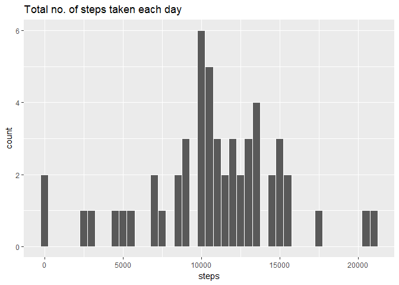
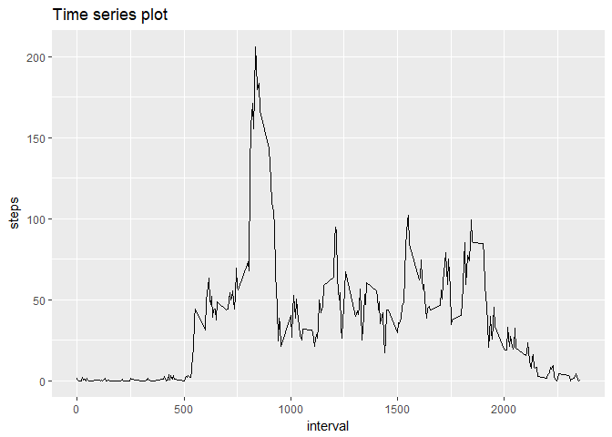
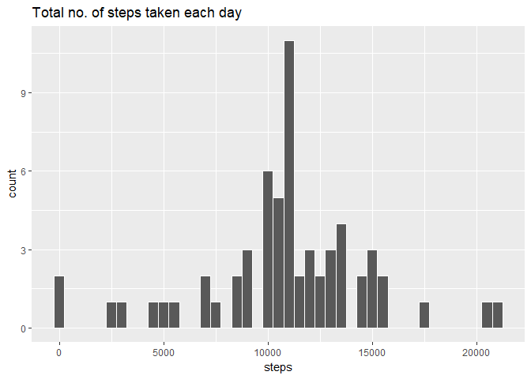
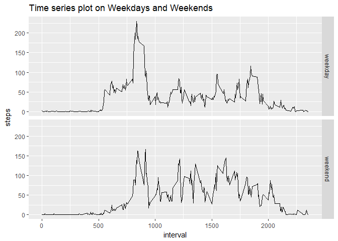

## Loading and preprocessing the data
Load the data (i.e. read.csv())

```r
data1 <- read.csv("activity.csv")
```

## What is mean total number of steps taken per day?
Here missing values are ignored.

1. Calculate the total number of steps taken per day

```r
total_steps <- aggregate(data1$steps, by = list(data1$date), sum)
```

2. Make a histogram of the total number of steps taken each day

```r
colnames(total_steps) <- c("date", "steps")
total_steps <- na.omit(total_steps)
library(ggplot2)
```

```
## Warning: package 'ggplot2' was built under R version 3.4.4
```

```r
p <- ggplot(total_steps,aes(steps))
g <- p+geom_histogram(binwidth = 500, col = "white")+labs(title = "Total no. of steps taken each day")
print(g)
```

<!-- -->

3. Calculate and report the mean and median of the total number of steps taken per day

```r
mean(total_steps$steps)
```

```
## [1] 10766.19
```

```r
median(total_steps$steps)
```

```
## [1] 10765
```

## What is the average daily activity pattern?

1. Make a time series plot (i.e. type = "l") of the 5-minute interval (x-axis) and the average number of steps taken, averaged across all days (y-axis)

```r
avg_steps <- aggregate(steps ~ interval, data = data1, mean)
colnames(avg_steps) <- c("interval", "steps")
p1 <- ggplot(avg_steps,aes(interval, steps)) + geom_line() + labs(title = "Time series plot")
print(p1)
```

<!-- -->

2. Which 5-minute interval, on average across all the days in the dataset, contains the maximum number of steps?

```r
avg_steps[which(avg_steps$steps == max(avg_steps$steps)),]
```

```
##     interval    steps
## 104      835 206.1698
```

## Imputing missing values
There are a number of days/intervals where there are missing values (coded as NA). The presence of missing days may introduce bias into some calculations or summaries of the data.

1. Calculate and report the total number of missing values in the dataset (i.e. the total number of rows with NAs)

```r
sum(is.na(data1))
```

```
## [1] 2304
```

2. Devise a strategy for filling in all of the missing values in the dataset. The strategy does not need to be sophisticated. For example, you could use the mean/median for that day, or the mean for that 5-minute interval, etc.

```r
replace_func <- function(num) replace(num, is.na(num), mean(num, na.rm = TRUE))
library(dplyr)
```

```
## Warning: package 'dplyr' was built under R version 3.4.3
```

```
## 
## Attaching package: 'dplyr'
```

```
## The following objects are masked from 'package:stats':
## 
##     filter, lag
```

```
## The following objects are masked from 'package:base':
## 
##     intersect, setdiff, setequal, union
```

```r
new_data <- (data1 %>% group_by(interval) %>% mutate(steps = replace_func(steps)))
```

```
## Warning: package 'bindrcpp' was built under R version 3.4.4
```

3. Create a new dataset that is equal to the original dataset but with the missing data filled in.

```r
replaced_data <- data.frame(new_data)
```
This data set has its missing values replaced with the mean of 5 minute interval.

4. Make a histogram of the total number of steps taken each day and Calculate and report the mean and median total number of steps taken per day. Do these values differ from the estimates from the first part of the assignment? What is the impact of imputing missing data on the estimates of the total daily number of steps?

```r
new_total_steps <- aggregate(replaced_data$steps, by = list(replaced_data$date), sum)
colnames(new_total_steps) <- c("date", "steps")
p2 <- ggplot(new_total_steps,aes(steps))
g2 <- p2+geom_histogram(binwidth = 500, col = "white")+labs(title = "Total no. of steps taken each day")
print(g2)
```

<!-- -->

```r
mean(new_total_steps$steps)
```

```
## [1] 10766.19
```

```r
median(new_total_steps$steps)
```

```
## [1] 10766.19
```

The total no. of steps taken per day increased as compared to the ones with the mising values. The mean remained the same and the median also increased slightly.

## Are there differences in activity patterns between weekdays and weekends?
For this part the weekdays() function may be of some help here. Use the dataset with the filled-in missing values for this part.

1. Create a new factor variable in the dataset with two levels - "weekday" and "weekend" indicating whether a given date is a weekday or weekend day.

```r
replaced_data$week <- ifelse(weekdays(as.Date(replaced_data$date)) %in% c("Saturday", "Sunday"), "weekend", "weekday")
```

2. Make a panel plot containing a time series plot (i.e. type = "l") of the 5-minute interval (x-axis) and the average number of steps taken, averaged across all weekday days or weekend days (y-axis).

```r
final_data <-aggregate(steps ~ interval+ week, replaced_data, mean)
p3 <- ggplot(final_data, aes(interval, steps))+geom_line()+ facet_grid(week ~.)+ labs(title = "Time series plot on Weekdays and Weekends")
print(p3)
```

<!-- -->

